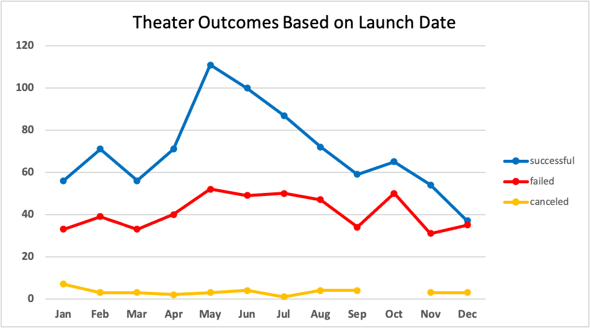
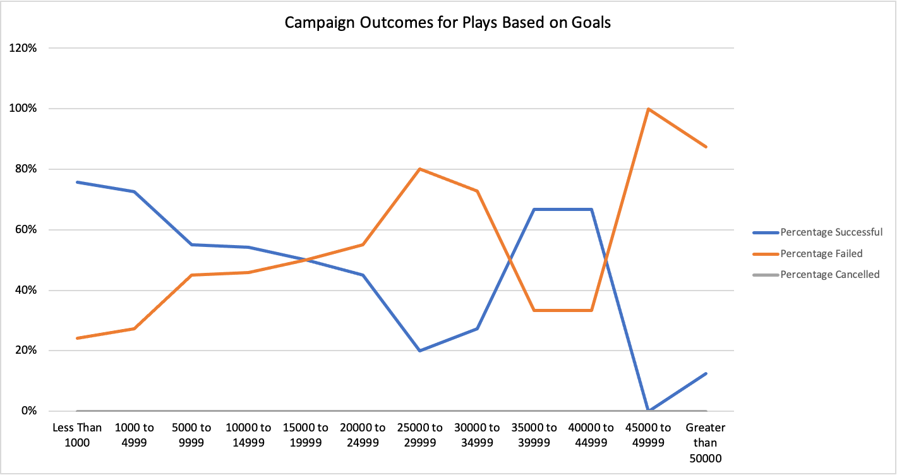

# Kickstarting with Excel

## Overview of Project
Performing analysis on Kickstarter data to uncover trends

### Purpose
Louise is an up-and-coming playwright that wants to start a Kickstarter campaign to raise funds for her new play "*Fever*". In this project we will analyze data from previous Kickstarter campaigns in order to identify which factors will give Louise the greatest likelihood of launching a successful campaign. 

## Analysis and Challenges
For this analysis, we compiled data from previous Kickstarter campaigns for theater projects, with a special focus on plays so that the information is relevant to Louise. In particular, we assesed the desired funding goals, countries where each campaign was launched, time of year campaigns were launched at, and the outcomes of those campaigns, including percentage funded, average donation, and number of backers. 

### Analysis of Outcomes Based on Launch Date
We first looked at the time of the year campaigns were launched to determine if there are particular months that correlate with greater campaign success. 

From this analysis, we can see that Theater Kickstarter campaigns launched in the summer, particularly in May and June, are the most successful. The success of campaigns launched in the summer declines gradually from May until September. Campaigns launched in the winter (November - January), have the fewest successful campaigns with a steep drop of in successful campaigns from November to December. The number of failed campaigns stays relatively constant throughout the year. Based on these findings, we recommend that Louise launch her campaign for "*Fever*" in May. 

### Analysis of Outcomes Based on Goals
Next, we analyzed campaign outcomes for plays based on funding goals.

The graph above includes data for theater campaigns launched worldwide. The average goal for successful campaigns in the US is around $5000. These data however, demonstrate that campaign goals of less than $1000 are the most successful with a 76% success rate followed closely by goals of up to $5000 with a 73% success rate. The average goal for failed campaigns is closer to $10,500 indicating that, as the campain goal increases, so does the risk of launching a failed campaign. The correlation however, is not perfectly linear as some campaigns with goals between $35,000 and $45,000 have a 67% success rate, while campaigns with goals between $25,000 and $30,000 have a 20% success rate. In order to launch a campaign with the greatest likelihood of success, we recommend that Louise set her goal to less than $1,000. If this is not possible, a goal of up to $5,000 is also reasonable. 

### Challenges and Difficulties Encountered 
The Kickstarter analysis dataset contains information from a wide variety of campaigns including video games, food trucks, movies, and more. While some of the campaigns from other categories may provide insight into general trends, it does not provide us with specific details about the kind of campaign that Louise wants to launch. Therefore, we filtered out campaigns that were not designed for theaters and plays, allowing us to provide Louise with a more customized plan. This is important because the goal amounts for campaigns in other categories may require very different funding goals. For instance, a technology focused campagin for a product like wireless earbuds will require much higher up front cost to fund development, production, and distritubtion than a theater play might. We do not want to provide a recommendation that would inform Louise to launch a campaign with unreasonable expectations. 

## Results

- *What are two conclusions you can draw about the Outcomes based on Launch Date?* ---
Kickstarter campaigns for theater productions are most successful when launched in the summer, particularly in May. Kickstarter campaigns launched in winter are the least successful, especially in December, which is the only month that has more failed than successful campaigns. 

- *What can you conclude about the Outcomes based on Goals?* ---
In general, the lower the goal for a campaign, the more likely it is to be successful. A goal of $5,000 or less is recommended for a Kickstarter campaign raising money for a play.

- *What are some limitations of this dataset?* ---
Some of the campaigns in this dataset have fundraising goals as low as $1. These may arise from errors, or could simply be that the user wanted to get their name out of Kickstarter. Either way, we know that goals this low are not going to help Louise lanch a successul Kickstarter campaign. Because we do not know if these outliers are typo errors, or inentional goals, we did not filter them out of the dataset means that our average goal amount may be skewed. Additionally, there may be theather campaigns in these data that are fundraising for building an entire theater. These would be unreasoable goals for Louise's small play production.

Another limitation encountered is that, while the information here can provide Louise with general recommendations concerning proposed goal amounts and when to launch her campaign, it does not provide information on where and how to focus fundraising. We do not know what kinds of donors are more likely to provide funding for theater productions, and where to share her Kickstarter information to reach these individuals. We also do not know what tools Louise should implement to best advertise her campaign. Are promo videos the most effective way to grab the attention of donors? How useful is social media for this particular kind of campaign? This is information we do not have, but would be highly informative.

- *What are some other possible tables and/or graphs that we could create?* ---
It would be helpful to have a box and whisker plot comparing goals with pledged amounts for theater campaigns. This would allow us to identify the outliers described in limitations, and get a better understanding of what the pledged amount typically comes out to. 
Another resource that would be informative for our analyses would be the average number of backers and donation amount for campaigns based on goals. This would allow Louise to anticipate how many donors she needs, and request an average donation amount that would get her to her fundraising goal. 
